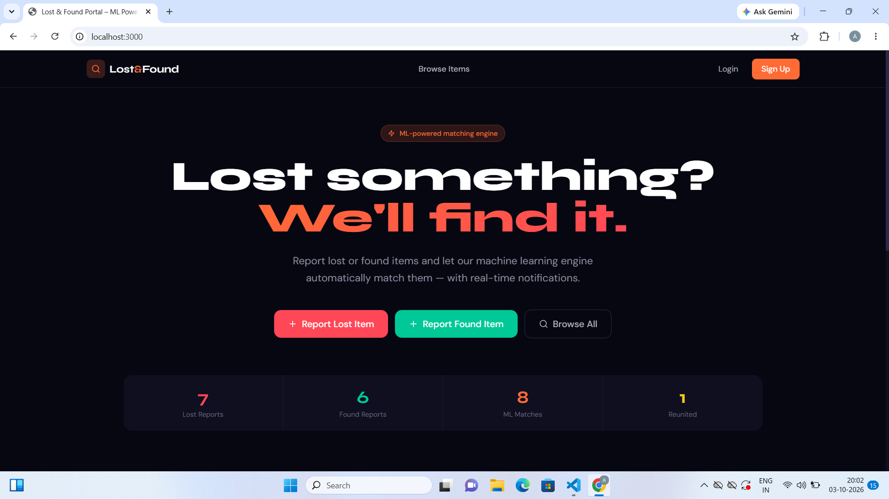

# 🔎 Lost & Found Portal

A full-stack **Lost & Found Portal** designed to help users report lost items, post found items, search for items, and connect with other users to recover their belongings.

The platform provides a centralized system for managing lost and found items with **user authentication, item management, search, image uploads, real-time communication, and secure access**.

---

## 📌 Table of Contents

- [Overview](#-overview)
- [Problem Statement](#-problem-statement)
- [Objectives](#-objectives)
- [Key Features](#-key-features)
- [Screenshots](#-screenshots)
- [Demo Video](#-demo-video)
- [Technology Stack](#-technology-stack)
- [System Architecture](#-system-architecture)
- [Project Structure](#-project-structure)
- [Prerequisites](#-prerequisites)
- [Installation & Setup](#-installation--setup)
- [Environment Variables](#-environment-variables)
- [Running the Application](#-running-the-application)
- [Application Workflow](#-application-workflow)
- [API Overview](#-api-overview)
- [Database](#-database)
- [Authentication & Security](#-authentication--security)
- [Real-Time Communication](#-real-time-communication)
- [Future Enhancements](#-future-enhancements)
- [Applications](#-applications)
- [Contributing](#-contributing)
- [License](#-license)
- [Author](#-author)

---

# 📖 Overview

The **Lost & Found Portal** is a web-based application that provides a digital platform for reporting and recovering lost belongings.

Users can:

- Register and log in securely
- Report lost items
- Report found items
- Upload item images
- Search for lost/found items
- View item details
- Update or delete their own posts
- Communicate with other users
- Track item status
- Manage their profile

The application is designed to reduce the difficulty of finding lost belongings by bringing lost and found reports into one centralized platform.

---

# ❗ Problem Statement

When people lose their belongings in colleges, workplaces, public places, or communities, finding them can be difficult because there is often no centralized platform for reporting and searching for lost items.

Traditional methods such as:

- Asking people individually
- Posting in WhatsApp groups
- Checking notice boards
- Contacting security departments

can be inefficient and difficult to track.

The Lost & Found Portal provides a centralized digital solution where users can report, search, and communicate about lost and found items.

---

# 🎯 Objectives

The main objectives of the project are:

1. Provide a centralized platform for lost and found items.
2. Allow users to create lost-item reports.
3. Allow users to create found-item reports.
4. Provide image-based item identification.
5. Make item searching easier.
6. Enable communication between users.
7. Provide secure authentication.
8. Maintain item information in a structured database.
9. Reduce the time required to recover lost belongings.

---

# ✨ Key Features

## 👤 User Authentication

- User registration
- User login
- JWT-based authentication
- Secure password handling
- Protected routes
- User profile management

## 📌 Lost Item Reporting

Users can report lost items by providing information such as:

- Item name
- Category
- Description
- Location
- Date
- Image
- Contact information

## 📦 Found Item Reporting

Users who find an item can create a found-item report containing:

- Item name
- Category
- Description
- Found location
- Date found
- Image
- Additional information

## 🔎 Search & Filtering

Users can search for items using different criteria such as:

- Item name
- Category
- Location
- Lost/Found status

## 🖼️ Image Upload

Users can upload images of lost or found items to make identification easier.

## 💬 Real-Time Communication

The portal supports real-time communication between users using WebSocket-based communication.

This allows users to communicate regarding a reported item without relying entirely on external messaging platforms.

## 📊 Item Management

Users can:

- Create posts
- View posts
- Update posts
- Delete their posts
- Track item status

## 🔐 Secure Access

The application uses authentication and authorization mechanisms to protect user data and restricted operations.

---

# 📸 Screenshots

> Add your actual project screenshots inside the `screenshots` folder.

### 🏠 Home Page




---

### 🔐 Login Page


---

### 📝 Registration Page


---

### 🔎 Lost & Found Dashboard


---

### 📌 Report Lost Item


---

### 📦 Report Found Item


---

### 🔍 Search Items


---

### 👤 User Notification


---

# 🎥 Demo Video

## Project Demonstration

Watch the complete demonstration of the Lost & Found Portal:

**▶️ Demo Video:**  
[Click here to watch the project demo](https://www.youtube.com/watch?v=NTJgknb4H-U)

> Replace `YOUR_DEMO_VIDEO_LINK` with your YouTube, Google Drive, or other publicly accessible demo video link.

### Demo Covers

The demonstration includes:

1. User registration
2. User login
3. Dashboard
4. Reporting a lost item
5. Reporting a found item
6. Uploading images
7. Searching for items
8. Viewing item details
9. User-to-user communication
10. Updating item information
11. Deleting posts
12. Logout

---

# 🛠️ Technology Stack

## Frontend

- React.js
- JavaScript
- HTML5
- CSS3
- Axios
- React Router

## Backend

- Python
- Flask
- Flask-SocketIO
- REST APIs
- JWT Authentication

## Database

- MongoDB

## Real-Time Communication

- Socket.IO
- WebSockets

## Development Tools

- Visual Studio Code
- Git
- GitHub
- Postman
- MongoDB

---

# 🏗️ System Architecture

```text
                    ┌──────────────────────┐
                    │       User           │
                    └──────────┬───────────┘
                               │
                               ▼
                    ┌──────────────────────┐
                    │    React Frontend    │
                    │                      │
                    │  UI + Routing +      │
                    │  API Communication   │
                    └──────────┬───────────┘
                               │
                         HTTP / REST
                               │
                               ▼
                    ┌──────────────────────┐
                    │    Flask Backend     │
                    │                      │
                    │ Authentication       │
                    │ REST APIs            │
                    │ Business Logic       │
                    └──────────┬───────────┘
                               │
                ┌──────────────┴──────────────┐
                │                             │
                ▼                             ▼
       ┌─────────────────┐          ┌─────────────────┐
       │    MongoDB      │          │   Socket.IO     │
       │                 │          │                 │
       │ Users           │          │ Real-Time Chat  │
       │ Items           │          │                 │
       │ Reports         │          └─────────────────┘
       └─────────────────┘
```

---

# 📁 Project Structure

```text
lost-found-portal/
│
├── backend/
│   │
│   ├── app.py
│   ├── requirements.txt
│   ├── .env
│   │
│   ├── routes/
│   ├── models/
│   ├── utils/
│   └── uploads/
│
├── frontend/
│   │
│   ├── public/
│   ├── src/
│   │   ├── components/
│   │   ├── pages/
│   │   ├── services/
│   │   ├── context/
│   │   ├── App.jsx
│   │   └── main.jsx
│   │
│   ├── package.json
│   └── package-lock.json
│
├── screenshots/
│   ├── home.png
│   ├── login.png
│   ├── register.png
│   ├── dashboard.png
│   ├── report-lost.png
│   ├── report-found.png
│   ├── search.png
│   ├── chat.png
│   └── profile.png
│
├── .gitignore
└── README.md
```

> Adjust the structure above if your actual project folders are different.

---

# ⚙️ Prerequisites

Before running the project, install:

- Python 3.x
- Node.js
- npm
- MongoDB
- Git

Check installed versions:

```powershell
python --version
node --version
npm --version
mongod --version
```

---

# 🚀 Installation & Setup

## 1️⃣ Clone the Repository

```powershell
git clone YOUR_GITHUB_REPOSITORY_URL
```

Move into the project:

```powershell
cd lost-found-portal
```

---

# 🐍 Backend Setup

Open PowerShell:

```powershell
cd backend
```

Create a virtual environment:

```powershell
python -m venv .venv
```

Activate it:

```powershell
.\.venv\Scripts\Activate.ps1
```

If activation is successful, you should see:

```text
(.venv)
```

---

## Install Backend Dependencies

```powershell
pip install -r requirements.txt
```

---

# 🍃 MongoDB Setup

Make sure MongoDB is running before starting the backend.

If MongoDB is installed as a Windows service, start it using:

```powershell
net start MongoDB
```

Alternatively, run MongoDB manually using your installed MongoDB executable.

The default MongoDB connection used by the application is:

```text
mongodb://127.0.0.1:27017/
```

---

# 🔐 Environment Variables

Create a `.env` file inside the `backend` directory.

Example:

```env
MONGO_URI=mongodb://127.0.0.1:27017/
DB_NAME=lost_found_portal
JWT_SECRET_KEY=change-this-secret-key
PORT=5000
```

### Environment Variable Description

| Variable | Description |
|---|---|
| `MONGO_URI` | MongoDB connection URL |
| `DB_NAME` | MongoDB database name |
| `JWT_SECRET_KEY` | Secret key used for JWT authentication |
| `PORT` | Backend server port |

⚠️ Never upload your real `.env` file to GitHub.

Add it to `.gitignore`:

```text
.env
.venv/
__pycache__/
node_modules/
```

---

# ▶️ Running the Backend

From the backend directory:

```powershell
python app.py
```

The backend should run on:

```text
http://localhost:5000
```

---

# ⚛️ Frontend Setup

Open another PowerShell terminal.

Navigate to the frontend:

```powershell
cd lost-found-portal
cd frontend
```

Install dependencies:

```powershell
npm install
```

Start the development server:

```powershell
npm run dev
```

If your project uses another start command, use the command specified in `package.json`.

The frontend will usually be available at:

```text
http://localhost:5173
```

---

# 🔄 Running the Complete Application

You need to run the services separately.

### Terminal 1 — MongoDB

```text
MongoDB
```

### Terminal 2 — Backend

```powershell
cd backend
.\.venv\Scripts\Activate.ps1
python app.py
```

### Terminal 3 — Frontend

```powershell
cd frontend
npm run dev
```

Then open the frontend URL in your browser.

---

# 🔁 Application Workflow

```text
User
 │
 ▼
Register / Login
 │
 ▼
Authentication
 │
 ▼
Dashboard
 │
 ├───────────────┐
 │               │
 ▼               ▼
Report Lost    Report Found
 │               │
 └───────┬───────┘
         ▼
      Database
         │
         ▼
 Search / Filter
         │
         ▼
 View Item
         │
         ▼
 Contact User
         │
         ▼
 Real-Time Chat
         │
         ▼
 Item Recovered
```

---

# 🔌 API Overview

The backend provides REST APIs for application functionality.

Typical API operations include:

### Authentication

```text
POST /api/register
POST /api/login
```

### Items

```text
GET    /api/items
POST   /api/items
GET    /api/items/<id>
PUT    /api/items/<id>
DELETE /api/items/<id>
```

### User

```text
GET /api/profile
PUT /api/profile
```

> Update these endpoint names if your actual Flask routes use different paths.

---

# 🗄️ Database

The project uses **MongoDB** as its database.

The main database is:

```text
lost_found_portal
```

Possible collections include:

```text
users
items
messages
```

### Users

Stores user-related information such as:

- User ID
- Name
- Email
- Password hash
- Profile information

### Items

Stores information about:

- Item name
- Category
- Description
- Location
- Date
- Image
- Lost/Found status
- User information

### Messages

Stores or manages communication-related information between users when applicable.

---

# 🔐 Authentication & Security

The application implements authentication using **JSON Web Tokens (JWT)**.

Security-related features include:

- JWT authentication
- Protected API routes
- Password hashing
- Authorization checks
- Environment variables for sensitive configuration
- User-specific access to protected operations

Users should not be able to modify or delete another user's posts unless the application explicitly provides such functionality.

---

# 💬 Real-Time Communication

The application uses **Socket.IO / WebSocket-based communication** to support real-time interaction.

This enables users to communicate about lost and found items without needing to continuously refresh the page.

### Communication Flow

```text
User A
   │
   │ Message
   ▼
Socket.IO
   │
   ▼
Backend
   │
   ▼
Socket.IO
   │
   ▼
User B
```

---

# 📱 Responsive Design

The frontend is designed to provide a user-friendly experience across different screen sizes.

The portal can be used on:

- 💻 Desktop
- 💻 Laptop
- 📱 Mobile devices
- 📟 Tablets

---

# 🌍 Real-World Applications

The Lost & Found Portal can be implemented in:

### 🎓 Colleges & Universities

Students can report:

- ID cards
- Books
- Laptops
- Mobile phones
- Bags
- Keys

### 🏢 Offices

Employees can report:

- Documents
- ID cards
- Electronic devices
- Personal belongings

### 🏥 Hospitals

Patients and staff can report lost belongings.

### 🚉 Public Places

The system can potentially be adapted for:

- Bus stations
- Railway stations
- Airports
- Shopping malls
- Public events

---

# 🌟 Benefits

- Centralized lost & found management
- Faster item discovery
- Easy reporting
- Image-based identification
- Search and filtering
- Real-time communication
- Secure user authentication
- Reduced dependency on manual reporting

---

# 🔮 Future Enhancements

The project can be further enhanced with:

- 🤖 AI-based image matching
- 📍 GPS/location-based search
- 🔔 Push notifications
- 📧 Email notifications
- 📱 Mobile application
- 🧠 Smart item matching
- 🏫 College-specific portals
- 🛡️ Admin moderation dashboard
- 📊 Analytics dashboard
- ☁️ Cloud deployment
- 🔎 Advanced search
- 🏷️ QR-based item identification

---

# 📈 Future AI-Based Matching

An advanced version of the system can compare images and descriptions of lost and found objects.

Example:

```text
Lost Item
   │
   ▼
Image + Description
   │
   ▼
AI Matching System
   │
   ▼
Potential Found Items
   │
   ▼
Similarity Score
   │
   ▼
User Notification
```

This can help users identify potentially matching lost and found items more efficiently.

---

# 🧪 Testing

The application can be tested using:

- Browser testing
- REST API testing
- Postman
- MongoDB database inspection
- Authentication testing
- Form validation testing
- Real-time communication testing

Important test cases include:

- Successful registration
- Invalid login
- Valid login
- Creating a lost item
- Creating a found item
- Image upload
- Search functionality
- Updating posts
- Deleting posts
- Unauthorized access
- Real-time messaging

---

# 🐛 Troubleshooting

## Backend does not start

Check whether the virtual environment is activated:

```powershell
.\.venv\Scripts\Activate.ps1
```

Then install dependencies:

```powershell
pip install -r requirements.txt
```

---

## MongoDB connection error

Make sure MongoDB is running.

Check the MongoDB URI in `.env`:

```env
MONGO_URI=mongodb://127.0.0.1:27017/
```

---

## Frontend dependencies error

Run:

```powershell
npm install
```

Then:

```powershell
npm run dev
```

---

## Port already in use

Check whether another application is already using the backend/frontend port.

Stop the previous server and restart the application.

---

# 📂 Screenshots Folder

Create the following folder:

```text
screenshots/
```

Recommended screenshots:

```text
screenshots/
│
├── home.png
├── login.png
├── register.png
├── dashboard.png
├── report-lost.png
├── report-found.png
├── search.png
├── item-details.png
├── chat.png
└── profile.png
```

Then GitHub will automatically display them in the README.

---

# 🎥 Adding Your Demo Video

For a YouTube video, use:

```markdown
## 🎥 Demo Video

[▶️ Watch the Complete Project Demo](YOUR_YOUTUBE_LINK)
```

For example:

```markdown
## 🎥 Demo Video

[▶️ Watch Lost & Found Portal Demo](https://www.youtube.com/watch?v=YOUR_VIDEO_ID)
```

---

# ⭐ Project Highlights

```text
✔ Full-Stack Web Application
✔ React Frontend
✔ Flask Backend
✔ MongoDB Database
✔ JWT Authentication
✔ REST APIs
✔ Image Upload
✔ Search & Filtering
✔ Real-Time Communication
✔ User Profile Management
✔ Lost & Found Item Management
```

---

# 🤝 Contributing

Contributions are welcome.

To contribute:

1. Fork the repository.
2. Create a new branch.

```bash
git checkout -b feature/new-feature
```

3. Make your changes.
4. Commit the changes.

```bash
git commit -m "Add new feature"
```

5. Push the branch.

```bash
git push origin feature/new-feature
```

6. Create a Pull Request.

---

# 📄 License

This project is created for educational and portfolio purposes.

You may modify and extend the project according to your requirements.

---

# 👩‍💻 Author

## Ankitha Kanneboina

**B.Tech – Computer Science and Engineering**

Interested in:

- Artificial Intelligence
- Machine Learning
- Full-Stack Development
- Web Technologies
- Software Development

### Connect With Me

- GitHub: [Ankitha Kanneboina](https://github.com/ankithakanneboina)
- LinkedIn: [Ankitha Kanneboina](https://www.linkedin.com/in/ankitha-kanneboina-45a545324/)

---

# ⭐ If You Like This Project

If you find this project useful, consider giving the repository a ⭐ on GitHub.

---

## 🚀 Lost & Found Portal

**Report. Search. Connect. Recover.**

A centralized digital platform designed to make finding lost belongings easier and more efficient.
